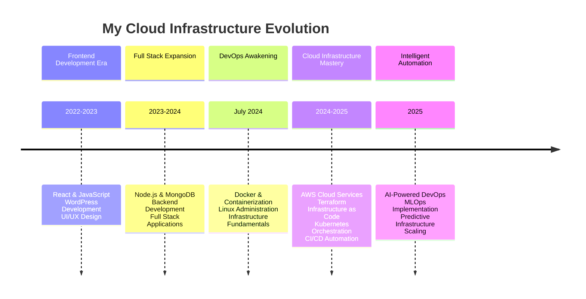

# Iftikhar Ali
### DevOps Engineer | Cloud Infrastructure Specialist

---

## ⚙️ My Tech Stack

  
  
  
  
  
  
  
  
  
  
  

---

## 🚀 My DevOps Transformation Journey

----
---

## 🌟 Code Energy

<!-- Animated Header -->

  

<!-- Floating Stats Grid -->

<!-- Glowing Stats Card -->

  

  <h4 style="color: #58A6FF; margin: 0 0 0.5rem 0; font-size: 14px;">🚀 DEVELOPMENT ACTIVITY</h4>
  

<!-- Pulsing Streak Card -->

  

  <h4 style="color: #FF6B6B; margin: 0 0 0.5rem 0; font-size: 14px;">🔥 CONTRIBUTION STREAK</h4>
  

<!-- Snake Animation with Glow -->

  <h4 style="color: #00D4FF; margin: 0 0 0.5rem 0; text-align: center; font-size: 14px;">🐍 CONTRIBUTION SNAKE</h4>
  

<!-- Quick Stats Bar -->

  

    📚 REPOS
  

  

    ⭐ STARS
  

  

    🔀 PRs
  

  

    💫 COMMITS
  

---
---

## 📈 Contributions & Activity

---

## 🏗️ Featured Infrastructure Projects  
⚙️ — — — ⚙️  

**Terraform AWS Infrastructure**  
Production-ready modules for multi-environment deployments with automated scaling and security configurations.  

**Intelligent CI/CD Pipelines**  
AI-enhanced automation workflows featuring predictive testing and smart rollback capabilities.  

**Kubernetes Cluster Management**  
Container orchestration with advanced monitoring, auto-scaling, and service mesh implementations.  

**Full Stack Dashboard**  
React + Node.js + MongoDB application with complete authentication system and DevOps deployment.  

---

## 📡 Live Status Dashboard

---
## 🎯 Technical Expertise

<b>🛠️ Core DevOps & Cloud (Click to expand)</b>

### **Infrastructure as Code**
**Terraform**, **CloudFormation**

### **Cloud Native Technologies**
**Kubernetes**, **Docker**, **Helm**

### **DevOps Automation**
**GitHub Actions**, **Jenkins**

### **Multi-cloud Strategies**
**AWS**, **Azure**, **GCP**

### **Service Mesh & Monitoring**
**Istio**, **Prometheus**, **Grafana**

<b>🔧 Advanced & Specialized (Click to expand)</b>

### **Security & Compliance**
**IAM**, **VPC**, **RDS**, **Network Policies**

### **Microservices & CI/CD**
**Pipeline Design**, **Blue-Green Deployment**, **Rollback Systems**

### **AI & Intelligent Automation**
**Predictive Scaling**, **MLOps Integration**, **AI-Driven Infrastructure**

### **Full Stack Development**
**React**, **Node.js**, **MongoDB**, **REST APIs**, **Python**, **JavaScript**

---

## 📫 Connect With Me

<small>Software Engineering Student @ Karakoram International University (KIU)</small>

---

## 💭 Engineering Philosophy  
⚙️ — — — ⚙️  

> “Infrastructure should be invisible until it's needed, and flawless when it is.”  
> “We don't just automate tasks — we amplify human potential through intelligent systems.”  
> “Every line of infrastructure code is a promise of reliability and scalability.”  

<i>Building the future, one pipeline at a time. Let's create something extraordinary together! 🚀</i>  

---

## 🏆 GitHub Achievements & Highlights

---

