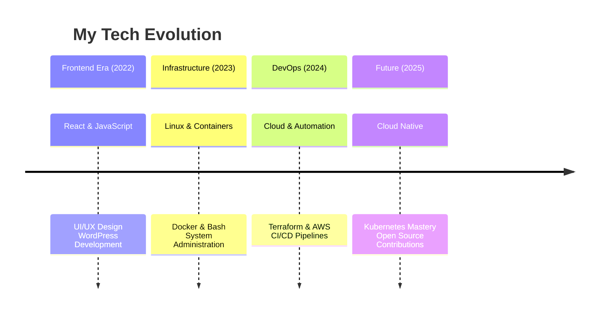

<!-- UNIQUE ANIMATED HEADER -->

  

<!-- 3D ANIMATED PROFILE -->

<!-- GLOWING TITLE -->
<h1 align="center">
   
  Cloud Infrastructure Engineer
  
</h1>

<!-- ANIMATED DIVIDER -->

<!-- INTERACTIVE TECH GRID -->
<h2>🚀 Tech Arsenal</h2>

  
| **Cloud Platforms** | **Infrastructure** | **DevOps Tools** | **Development** |
|:---:|:---:|:---:|:---:|
|   |   |   |   |
|   |   |   |   |

<!-- ANIMATED DIVIDER -->

<!-- INTERACTIVE STATS DASHBOARD -->
<h2>📊 Live GitHub Dashboard</h2>

<!-- REAL-TIME STATS GRID -->

| **Coding Activity** | **Achievements** | **Streak & Impact** |
|:---:|:---:|:---:|
|  |  |  |

<!-- 3D CONTRIBUTION MAP -->
<h2>🌌 Code Galaxy</h2>

<!-- ANIMATED CONTRIBUTION GRAPH -->

  

<!-- FLOATING SNAKE -->

<!-- PROJECT SHOWCASE WITH CARDS -->
<h2>🚀 Featured Creations</h2>

| **Infrastructure** | **Automation** | **Web Solutions** |
|:---:|:---:|:---:|
| **🏗️ Terraform AWS Modules**   Production-ready infrastructure as code with multi-environment support | **⚡ DevOps Toolkit**   Custom scripts for cloud automation and deployment pipelines | **🌐 Modern Portfolio**   React + DevOps integration with automated workflows |
|    [Explore →](https://github.com/iftikhar69/Creating-vpc-Modules-) |  |  |

<!-- JOURNEY TIMELINE -->
<h2>⏳ Evolution Timeline</h2>

<!-- GOALS PROGRESS --><h2>🎯 2025 Mission Control</h2>

Goal	Progress	Status
Kubernetes Mastery	https://progress-bar.vercel.app/90?width=200&color=00D4FF	🚀 Almost There
Terraform Framework	https://progress-bar.vercel.app/75?width=200&color=00D4FF	⚡ In Progress
CI/CD Automation	https://progress-bar.vercel.app/60?width=200&color=00D4FF	🔧 Building
Open Source	https://progress-bar.vercel.app/40?width=200&color=00D4FF	🌱 Starting

<!-- CONTACT WITH FLOATING EFFECT --><h2>📡 Connect Matrix</h2>

https://img.shields.io/badge/%F0%9F%93%A7_EMAIL-iftikharali081144@gmail.com-00D4FF?style=for-the-badge&logo=gmail&logoColor=white
https://img.shields.io/badge/%F0%9F%92%BC_LINKEDIN-Iftikhar_Ali-0077B5?style=for-the-badge&logo=linkedin&logoColor=white
https://img.shields.io/badge/%F0%9F%90%99_GITHUB-iftikhar69-181717?style=for-the-badge&logo=github&logoColor=white
https://img.shields.io/badge/%F0%9F%8C%90_PORTFOLIO-Coming_Soon-6e5494?style=for-the-badge&logo=vercel&logoColor=white

<!-- PHILOSOPHY WITH GLOW --><h2>💫 Developer Manifesto</h2><blockquote align="center" style="border-left: 4px solid #00D4FF; padding-left: 15px; background: #0D1117; border-radius: 10px; padding: 20px;"> 
 <strong>"We don't just write code — we architect digital ecosystems"</strong> 
 
 Every line of infrastructure code is a promise of reliability  Every automation script is a step toward human amplification  Every deployed system is a testament to scalable design 
 </blockquote><!-- FLOATING FOOTER -->
 
 <strong>🚀 Thanks for exploring my digital universe!</strong> 
 
   
 
 <em>Let's build the future of cloud infrastructure together! 🌟</em> 

